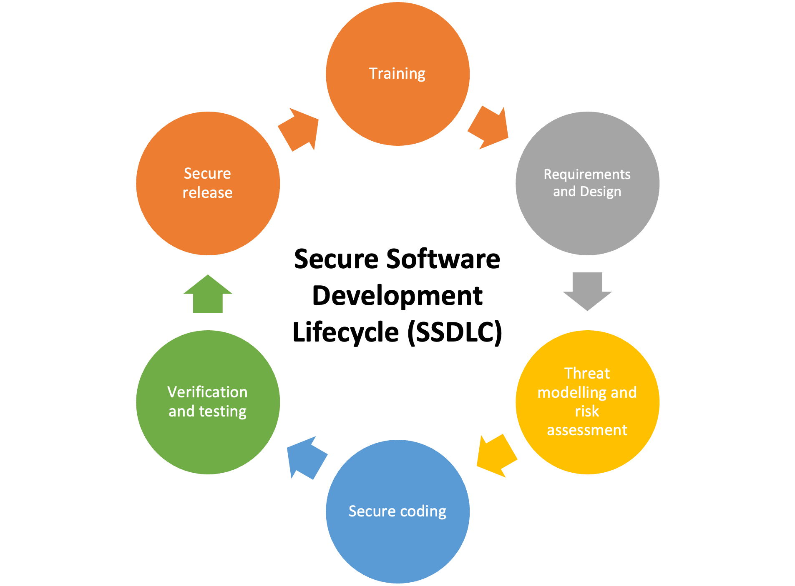

<!--{: style="float: right" height="350px" with="300px"}-->

{: height="450px" with="350px"}

## The Standard Secure Software Development Lifecycle (SSDLC) Process

Nowadays enterprises that are going through a digital transformation are more and more concerned with improving their security practices. This is because:
1. Product security became of utmost importance with the wide adoption of micro-services and API-driven architectures;
2. With the migration to the public cloud, the attack surface of the applications has largely increased, leading to an increased number of vulnerabilities.

Nevertheless, due to a number of factors, the AppSec teams, services and budget have not changed significantly over the last years. So it's important to understand how to scale up the AppSec services such that the AppSec team can keep up with the fast-paced software development inherent to the DevOps way of working.
<!--

-->

*In this post I address this topic, by describing the main elements that are part of the AppSec ecosystem and how a scalable AppSec program could look like.*

---

## DevSecOps
The standard Secure Software Development Lifecycle (SSDLC) process has gone through several iterations over the past years. Mostly, the phases of the process had not changed significantly, but instead, these phases tried to adapt to the different development methodologies. If we consider the most popular and adopted software engineering methodologies, SSDLC started with being Waterfall, then adapted itself to Agile development and now DevOps, with DevSecOps.

DevSecOps means building security into application development from end-to-end. DevOps teams should automate security to protect the overall environment and data (see [RedHat description](https://www.redhat.com/en/topics/devops/what-is-devsecops) of DevSecOps here). However, this is far from being an easy task:
1. The maturity of the development teams with regards to security is not at the level it should be. So shifting the responsibility of automating security controls into the development process to the DevOps teams is most likely going to fail;
2. Additionally, DevOps teams may struggle (a lot) to securely configure and manage the infrastructure; with the massive adoption of public cloud environments as target platforms and all the different possible configurations that cloud resources offer, it's really hard to securely configure and manage the cloud infrastructure.

If we think that developing good quality software, fast, is already a laborious task, then imagine how hard it becomes when we start adding security on top of it.

Also, having each individual DevOps team automating security is not cost-effective. The cost can be colossal even, if we consider that each team uses a different CI/CD pipeline with different automated security tooling. When security services are not engineered and provided at an enterprise level, each DevOps team tends to reinvent the wheel and sometimes not doing it properly.

### DevSecOps is not enough…
DevSecOps is mainly focused on adding automated tooling to CI/CD pipelines to detect vulnerabilities earlier in the development process (the so-called shift-left). Despite agreeing that this brings an enormous benefit in terms of vulnerabilities detection at a faster pace, I also argue that this isn't enough. Throwing a lot of security scanners into CI/CD without any governance or guidance around how these findings should be addressed, only solves half of the problem. At the same time, I also believe that having a dedicated security engineer per DevOps team isn't a scalable approach. So, what's the solution then?

Keep in mind that the ultimate goal of the AppSec team should be enabling DevOps teams to autonomously drive and implement security in a mature way. So let's start with the foundations. Let's start by setting up the baseline policies and standards for your organisation that meet compliance requirements and are in-line with security best practices. Deriving policies and standards requires taking into account the enterprise architecture of the organisation, the nature of your applications, the IT strategy (including target technology stack and implementation strategy), compliance and legal requirements, the risk appetite of the organisation (which relates to type of industry and the type of data being processed), costs and budget, and the organisation culture.

## Baseline Policies and Standards
A strong governance approach starts with the definition with policies and standards that utilises an integrated approach to manage requirements. If you don't know the difference between policies and standards you can check it [here](https://www.complianceforge.com/word-crimes/policy-vs-standard-vs-control-vs-procedure).

Policies are enforced by standards. Standards establish the minimum security requirements that ensure that systems, applications and processes are designed and operated with the baseline security principles and protections. Without baseline security requirements to guide development teams on how security should be implemented in the applications, your AppSec team will be constantly overwhelmed and outnumbered. They will struggle so much with all the questions regarding with what's allowed or not, what's secure or not, that they won't be able to keep up and do the things that actually matter.

In principle, everyone within an enterprise should be responsible and accountable for implementing security policies and standards. The efforts of an AppSec team can only scale up, if everybody steers in the direction where policies and standard are consistently implemented.

In other for this to work, you must make sure the right procedures are implemented and that the adequate controls are in place. DevSecOps requires you to automate most of the procedures and controls (through compliance as code), so if you have well-defined baseline policies and standards, everything else will follow.

## An Enterprise Security Architecture
You can't scale up your AppSec services, if you don't have proper enterprise security services in place. The more the company grows, the more teams have the need to re-use security services in an integrated way.

For instance, all applications must integrate with the enterprise Identity and Access Management (IAM) service that is centrally managed by the corresponding team. Applications that need to talk to each other, must authenticate via the enterprise IAM service. It's not feasible to have each team implementing and managing its own IAM service. When centralised IAM services are not easy to embedded into the applications (or do not exist), what most DevOps teams tend to do is to use (hardcoded, never rotated, low-entropy) API keys. The activity of having teams exchanging API Keys (normally through email or SMS) is extremely dangerous and prone to attacks. Proper authentication and authorisation requires a good, well-integrated and easy to consume IAM service.

Another example are enterprise secret managers. These should also be centrally managed by the team that actually understands how to properly configure them. Secret managers are becoming complex beasts these days, and, in some cases, these require fully dedicated teams that implement and maintain these services within an enterprise. If centralised secret management is not in place, teams tend to use and/or create their own secret management version (or even worse, hardcode secrets in source code), implement the policies they deem useful and spend extra time operating them.

The enterprise security architecture should be aligned with the policies and guide the definition of the security standards. In one of the enterprises where I worked at, we actually started by defining the (enterprise) future state or reference architecture for that particular security service, then derived the standard security requirements and only later, abstract them into policies that meet compliance and legal requirements, as well as, the risk appetite of the enterprise. This worked very well. Deriving policies is always a cumbersome task if you don't know the organisation and underlying application landscape, so following this workflow helps immensely to derive realistic and adequate policies and standards.

## API-first security services
To scale up the secure development, you need to make your (previously designed) enterprise security services easy to consume, preferably, in a way that DevOps teams put little, to no effort in integrate them into their applications. This standard way of (1) raising a support ticket every time you need to integrate the secret manager or key management service into your application, (2) go through a meeting, (3) fill in a form, (4) read a bunch of documents to understand how to do the integration and (5) wait hours or days until your request gets approved, will hinder the speed of your development process.

So what should you do instead? Follow an API-driven approach such that all the services are directly accessible in the CI/CD pipeline. The teams can directly consume the services by directly calling the API or through pipeline extensions. For instance, every time a digital certificate is needed, instead of going through a lengthy and lagging manual process of obtaining a certificate from your external Certificate Authority, try instead to:
1. Expose the service of requesting a certificate through an API that takes care of all the validation steps required to obtain a certificate (authentication, authorisation, domain validation, etc.);
2. Integrate the API into the CI/CD pipeline as a simple pipeline task that only requires as input parameters: (1) the domain name, (2) type of certificate to be requested and (3) the name of the vault where the certificate must be stored;

This means that steps such as: key-pair generation, key-algorithm, CSR extraction and so on, are completely abstracted and hidden in this task. The pipeline task is then responsible for generating the appropriate key pair in the designated vault, extract the CSR, submit the CSR through the certificate services API, getting the signed certificate and deploying it back to the vault.

*Perhaps needless to say, but please note that security services such as the certificate services are also applications themselves. Therefore, they should be developed and implemented following the same principles described in this post. As such, integration with centralised IAM, key management service, centralised log manager and so on, are a must. If the service is not developed in a mature way, it will most likely hinder the speed of the applications in your enterprise (think about breaking entire production pipelines in the middle of the night) and clearly have low adoption rate. The reliability and scalability of these services is, as expected, of utmost importance.*

This pattern of developing API-first security services that abstract away (needless-to-care) configuration details, helps improving the speed with which you can develop applications and enhances their security by design and by default. This vision and principle is applicable to all enterprise security services.
So, when implementing DevSecOps, besides integrating the automated security scanners such as SAST, DAST, SCA, IAST, etc., into CI/CD pipelines, consider integrating the enterprise security services as well.

## Security Dashboards
Similarly to the security operations team with the usage of SIEM, the AppSec team shall also collect, aggregate and monitor all the security findings of all applications in the organisation. Whether these findings result from automated security scanners integrated in the pipelines, or manual security assessments, like penetration tests, it's important to have a holistic and centralised overview of the security posture of all applications.

Directly relating the findings to particular assets, together with the criticality of the data being processed by the application and where these assets are located in the network, helps identifying and prioritising the risk of exposure to threats.

The centralised overview of security findings shall be used to identify general flaws and gaps in the secure development process across the organisation, and not as way to determine the security posture of individual DevOps teams. When the same type of vulnerability starts increasing and doesn't get fixed within the expected cycle time, that means that some of the controls need to be re-evaluated and rethought. For instance, if suddenly passwords or keys are being hardcoded or stored in source code repositories, the AppSec team should first try to understand why:

1. Is it because there is no vault service available that allows DevOps teams to store secrets?
2. Is the central vault service easy to consume? Is it easy to integrate into the standard resources used by most applications?
3. Is the central vault service known? How much awareness and communication has been done with that regards?
4. Etc.

**Understanding why** the security controls and requirements are not being implemented is much more important than going after each individual team and ask them to fix it. The AppSec team can't solve problems at scale, if they're not able to find their root cause in the first place.

## The governance circles
So far I talked about the importance of security policies and standards, of security enterprise architecture, of easy to consume (API-first) security services and of a centralised overview of security findings. But unfortunately, even if you put all these pieces together, you may still see minimal improvements in the security of the applications within your organisation. Therefore, a strong and effective information security governance is essential to make these pieces work altogether. A good governance resembles a maestro in an orchestra. If the maestro is not there to coordinate how the musicians play, certainly the orchestra will never play as harmoniously as you expect them to play.

Governing the security of the applications must have management support, including, senior management, human resources, compliance, legal, audit, risk management and, of course, IT. Everyone within the organisation should be responsible and accountable for the security of the applications, therefore awareness about the risks, policies and individual roles is fundamental.
The Security Champions program is a good way to constantly create this awareness. This program should serve, among other things, to constantly feed information about security policies, standards, architecture patterns and risks. This is a way of creating awareness in the DevOps teams, but awareness and commitment to continuously improve the security of products is needed across the entire organisational hierarchy.

A potential way to govern risks and applications security in the world of DevOps is by introducing what I call the governance circles. The idea of these governance circles is to evaluate the security risks, controls and results in a periodic basis and at different levels within the organisation.
Let's consider a typical IT organisation that includes the following structure:

1. DevOps teams consist of software engineers, software architect, lead engineer and the security champion (which is also a software engineer);
2. Two or more DevOps teams are organised into several departments inserted into a particular business line; each department consists of department lead, security engineer lead and a lead architect (of the department);

{: height="450px" with="300px"}

<!-- 

-->

Lets consider now three different governance circles that appear at different levels of the organisation:

**Team Governance Circle**: this is composed by the members of the DevOps team and every 3 weeks (or whatever is required for your organisation) this circle gathers in a meeting: the Team Governance meeting, to: (1) describe system changes and/or new features to be implemented; (2) discuss if the changes comply with policies and standards (3) brainstorm about newly introduced threats or risks; (4) check security metrics (resulting from the aggregated overview of the security findings) to see if the security posture of the team/application is improving or degrading; (5) if improving, then decide what can be improved next, if degrading, then discuss what went wrong. The highlights of this meeting, should be used as input for the department governance meeting.

**Department Governance Circle**: this is composed by the department lead, security engineer lead, lead architect, and the lead engineers of each DevOps teams (from the department). The department governance circle shall meet in the Department Governance meeting every 6 weeks (or so), to discuss (1) if there are any new compliance or policy deviations; (2) if there are newly introduced threats and/or risks; (3) understand if the risks can be accepted or must be mitigated (4) evaluate the aggregated security metrics at the department level to understand if the security posture is improving or degrading; (5) if improving, what can be addressed next, if degrading, identify roadblocks and check if priorities are still aligned. As before, the highlights of this meeting, should be used as input for the Security Management Governance meeting.

**Security Management Governance Circle**: this is composed by department leads, legal, compliance, executive members , IT lead, audit and risk management representatives. This circle should meet every quarter and shall address the same topics as the ones discussed in the Department Governance meeting, but at the organisation level and looking into the organisational aggregated metrics. The goal is always to identify risks, understand the gaps and improve the security of the applications.

The risks and threats addressed in circle meetings at the highest levels should be the ones that didn't get agreement or cause uncertainty at the lower levels. Certainly you should not expect that XSS vulnerabilities of application Z get discussed at the management level. That is not the purpose of these circle meetings.

The shape of these circles and the frequency with what these meetings happen is highly dependent on the organisational structure of your enterprise. Also, empowering the people with the right mindset is crucial to the success of this initiative. Making it practical, fun and valuable for the DevOps teams, as well as, having support and engagement of management, is key.

## A continuous application security stack
The keyword in the DevOps world is "continuous": continuous integration, continuous delivery, continuous deployment, continuous monitoring. So you also need to build a continuous application security (as described by Tim Chase in [his course](https://www.linkedin.com/learning/devsecops-continuous-application-security/the-rise-of-continuous-application-security?u=2074018)). This means that you continuously need to implement security in your applications by building your own continuous application stack.

{: height="450px" with="300px"}

<!--

-->

The continuous security application stack tries to combine all the layers described in this post into a single development environment and platform. At the bottom of the stack are the dashboards with metrics and alerts derived from the security findings, risks and events (the single-pane of glass). Having a single and aggregated overview of all the risks and vulnerabilities helps identifying the main gaps and act upon them. SIEM is more for the security operations team, but correlating these overviews and data does bring added value to the AppSec team too.

The manual assisted assessments like code reviews, penetration testing and so on, are also part of the secure development process and work mainly as supporting services. This is the reason why they are included in this stack. The frequency with what the AppSec team performs code reviews and threat assessments tends to decrease over time, as DevOps teams become more mature and follow the SSDLC process in a more autonomous and independent way (the Security Champions program is fundamental for this to happen).

One point that I have not described in depth is the importance of setting up a secure (cloud) computing platform. As described in the beginning of this post, with the massive adoption of public cloud environments and all the gazillions of possible configurations that cloud resources offer, it's really hard to securely configure and manage the cloud infrastructure. So, creating default (baseline) configurations of cloud resources with secure defaults, is essential to enable a secure platform in a fast paced DevOps environment. These can be available through configuration templates (stored in the central version control system where all the teams can contribute to) that implement reference implementations of the resources used within the organisation.

## Conclusions
In a nutshell, the picture below tries to summarise what is important to develop and scale up in an AppSec program, taking into account that the **ultimate goal is to delivery valuable secure applications, faster**. Therefore, it is very important to continuously monitor and improve all these layers to accommodate the fast-paced changes so intrinsic to the IT industry.

<!--

-->

I would like to finalise this post with some remarks:

1. **The AppSec team must be an actual DevOps team** - if the AppSec team doesn't work in a DevOps way, it will never fully understand and experience the struggles an actual DevOps team faces.
2. **Continuous improvement is a must** - the AppSec team should aim to constantly re-evaluate, innovate and continuously improve their products and services. The security engineers shall continuous drive the threat modelling initiatives, manual code reviews, penetration testing, etc. but most of all, the goal should be learning from these (operational) tasks and try to develop mechanisms that enable more automation and better results.
3. **The IT strategy matters for scaling up an AppSec program** - a clear IT and/or platform strategy are determinant for the success of the AppSec program. Without a clear vision it will be hard to prioritise implementation plans, be cost effective and reap the benefits of the AppSec program.
4. **Without management support you cannot achieve the right AppSec culture** - if implementing functionalities is always more important for senior managers than fixing security bugs (or any sort of bugs even), then DevOps and AppSec teams will constantly be fighting about what has the highest priority.

Summarising, having the AppSec team engaging solely with the DevOps teams is not enough. AppSec needs to engage with everybody in the organisation to drive the intended culture: platform team, legal and compliance, managers, etc. The success of an AppSec program heavily relies on collaboration and cooperation between all the parties.

---

**Additional remarks**

Through out this post I'm mostly focused in DevOps, but that doesn't mean that the ideas presented here are not extensible to other development methodologies. I do believe in the DevOps fundamental principles and believe that they can help improve the overall quality of software systems. But, I'm not very enthusiastic with the term DevSecOps. I only use it through this post to keep things simpler and more relatable to the common terminology used these days in the IT security.

Additionally, I consider privacy an extension of security. Privacy is not security, but without information security, you can't implement privacy. Despite privacy engineering is still in its infancy, most of the ideas described in this post are directly applicable to a software methodology that considers privacy by design and by default. In fact, these ideas might be even extended to other software quality properties, like maintainability, performance, etc.

---

**Acknowledgements**

I certainly wouldn't have written this post in the same way if hadn't experienced first had how policies, standards, reference and future state architectures are important for an organisation. So thanks Jacek Offierski for mentoring and pushing me in that direction.

Also, I wouldn't have such a holistic approach to security and software development if it wouldn't the amazing discussions and talks I have with Martijn Klingens and Bernard Knaapen. So again thanks guys, for pushing me to always think outside of the box.